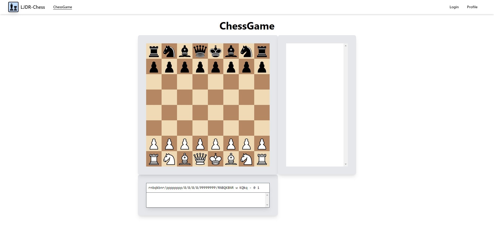
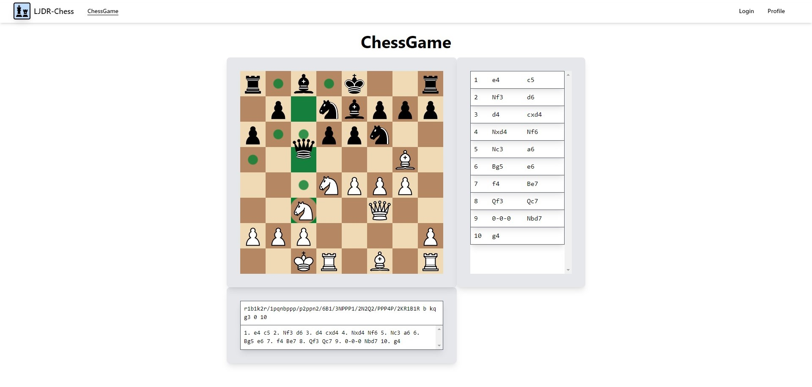
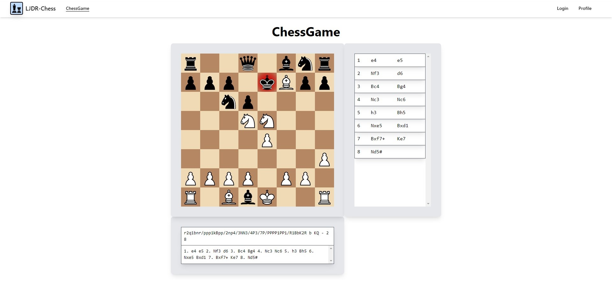
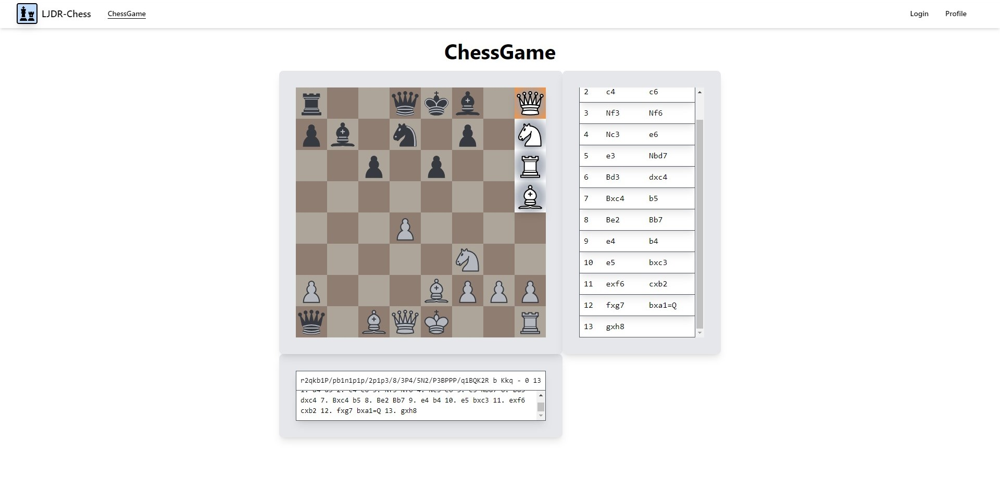

# LJDR-Chess

LJDR-Chess is an interactive chess board developed using React, Vite, and Tailwind CSS.

## Installation

1. Clone the repository:

   ```bash
   git clone https://github.com/ljdr64/ljdr-chess-react
   cd ljdr-chess-react
   ```

2. Install dependencies:

   ```bash
   npm install
   ```

## Usage

To run LJDR-Chess locally:

```bash
npm run dev
```

This will start the application in development mode. Open [http://localhost:5173](http://localhost:5173) in your browser to view the chess board.

## Technologies Used

- React
- Vite
- Tailwind CSS
- React Icons

## Features

- Interactive chess board
- Piece movement via drag and drop
- Chess notation
- Check and checkmate detection

## Screenshots

### Homepage



### Move Piece



### Check


### Checkmate



### White Promotion



### Black Promotion


## Contributing

If you'd like to contribute to LJDR-Chess, please follow these steps:

1. Fork the repository.
2. Create a new branch (`git checkout -b feature/AmazingFeature`).
3. Make your changes and commit them (`git commit -am 'Add some amazing feature'`).
4. Push to the branch (`git push origin feature/AmazingFeature`).
5. Open a pull request.

## License

This project is licensed under the [MIT License](link-to-license).
